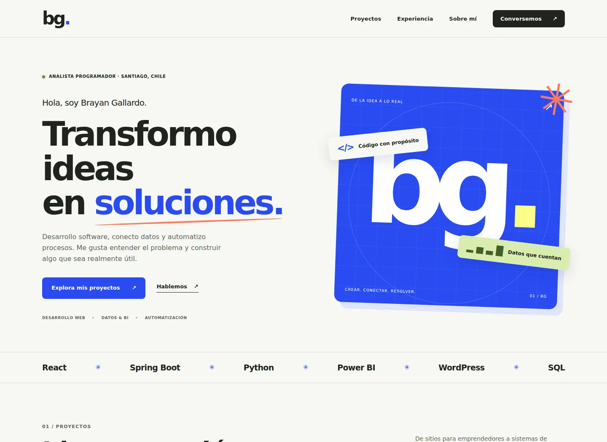

# Brayan Gallardo — Portafolio

Portafolio profesional de Brayan Gallardo, Analista Programador y fundador de ZPages. Reúne desarrollo web, sistemas de gestión, datos, automatización y backend.

Sitio: https://portafolio-brayangallardo.vercel.app/

## Vista previa del rediseño



[Vista en celular](docs/preview-mobile.webp)

## Desarrollo

Sitio estático en HTML, CSS y JavaScript. No requiere compilación ni dependencias de producción.

```sh
python -m http.server 8000
```

Abrir http://localhost:8000. Vercel puede servir la raíz directamente con el preset **Other**, sin comando de build.

## Estructura

- `index.html`: contenido, proyectos, experiencia, certificaciones y contacto.
- `styles.css`: diseño responsive y preferencias de movimiento reducido.
- `script.js`: filtros de proyectos y navegación móvil.
- `assets/`: capturas e imagen para compartir en redes.
- `tests/browser.cjs`: verificación de comportamiento en un navegador real.

## Contenido

Diez proyectos, agrupados en desarrollo web, sistemas de gestión, datos y automatización, y Full Stack / backend. Cada ficha presenta el desafío, participación, solución, funcionalidades y enlaces disponibles.

Los proyectos recientes son ZPages, Impresiones SYS, Fusión Sobre Ruedas y Newen Pintando. Se conservan CertiMentor, Data Consolidation Pipeline, AgroTech, Cyclistic y ambos ecommerce.

- Newen figura como demo en desarrollo: el repositorio mantiene `demo: true`.
- Fusión Sobre Ruedas figura en desarrollo; no se atribuye un stack no confirmado.
- Las capturas de Impresiones SYS y CertiMentor proceden de los recursos de ZPages. Las demás portadas son composiciones tipográficas, no capturas de aplicaciones.
- No se publican enlaces a repositorios privados ni URLs de demos no confirmadas.
- Las cifras de impacto se conservan del portafolio anterior y los ahorros se identifican como estimaciones.

## Accesibilidad y mejora progresiva

Todo el contenido y los desplegables funcionan sin JavaScript. Los filtros aparecen al inicializarse el script. La navegación móvil usa `aria-expanded`, se cierra al seleccionar un enlace y admite Escape. Se respetan las preferencias de movimiento reducido.

## Verificación

En un entorno de desarrollo con Node.js y Playwright:

```sh
npm install --no-save --package-lock=false playwright
npx playwright install chromium
python -m http.server 8000
# En otra terminal:
node tests/browser.cjs
```

Opcional: `TEST_URL` permite probar otro servidor; `CHROMIUM_EXECUTABLE_PATH` permite utilizar un Chromium instalado en el sistema.

Las pruebas cubren filtros y su reinicio, detalles de proyectos, menú móvil, ausencia de desbordamiento a 320, 390, 768 y 1440 px, errores JavaScript y contenido sin JavaScript.

## Contacto

- Email: brayan.algallardo@gmail.com
- LinkedIn: https://www.linkedin.com/in/brayan-gallardo-82617738a/
- GitHub: https://github.com/BrayanGallardo19
